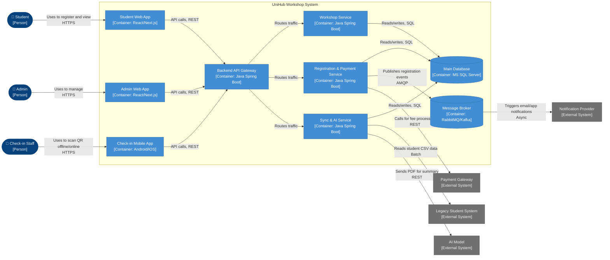

```mermaid
flowchart LR
    %% ── Persons ──
    Student(["👤 Student\n[Person]"])
    Admin(["👤 Admin\n[Person]"])
    Staff(["👤 Check-in Staff\n[Person]"])

    %% ── System Boundary ──
    subgraph SYS["UniHub Workshop System"]
        direction LR

        %% Front-end apps
        SWA["Student Web App\n[Container: React/Next.js]"]
        AWA["Admin Web App\n[Container: React/Next.js]"]
        CMA["Check-in Mobile App\n[Container: Android/iOS]"]

        %% API Gateway
        GW["Backend API Gateway\n[Container: Java Spring Boot]"]

        %% Services
        WS["Workshop Service\n[Container: Java Spring Boot]"]
        RPS["Registration & Payment Service\n[Container: Java Spring Boot]"]
        SAS["Sync & AI Service\n[Container: Java Spring Boot]"]

        %% Data stores
        DB[("Main Database\n[Container: MS SQL Server]")]
        MB[("Message Broker\n[Container: RabbitMQ/Kafka]")]
    end

    %% ── External Systems ──
    LSS["Legacy Student System\n[External System]"]
    PGW["Payment Gateway\n[External System]"]
    AIM["AI Model\n[External System]"]
    NP["Notification Provider\n[External System]"]

    %% ── Relationships ──
    Student  -->|"Uses to register and view\nHTTPS"| SWA
    Admin    -->|"Uses to manage\nHTTPS"| AWA
    Staff    -->|"Uses to scan QR offline/online\nHTTPS"| CMA

    SWA -->|"API calls, REST"| GW
    AWA -->|"API calls, REST"| GW
    CMA -->|"API calls, REST"| GW

    GW  -->|"Routes traffic"| WS
    GW  -->|"Routes traffic"| RPS
    GW  -->|"Routes traffic"| SAS

    WS  -->|"Reads/writes, SQL"| DB
    RPS -->|"Reads/writes, SQL"| DB
    SAS -->|"Reads/writes, SQL"| DB

    RPS -->|"Publishes registration events\nAMQP"| MB
    MB  -->|"Triggers email/app notifications\nAsync"| NP

    RPS -->|"Calls for fee processing\nREST"| PGW
    SAS -->|"Reads student CSV data\nBatch"| LSS
    SAS -->|"Sends PDF for summary\nREST"| AIM

    %% ── Styles ──
    classDef person   fill:#08427B,stroke:#08427B,color:#E8F2FF
    classDef container fill:#438DD5,stroke:#2E6DA4,color:#ffffff
    classDef external  fill:#707070,stroke:#505050,color:#F0F0F0

    class Student,Admin,Staff person
    class SWA,AWA,CMA,GW,WS,RPS,SAS,DB,MB container
    class LSS,PGW,AIM,NP external
```
