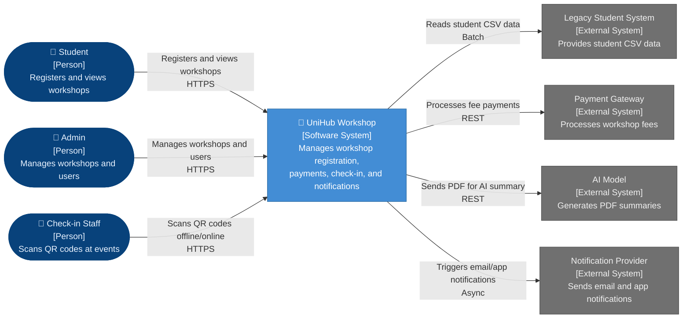

```mermaid
flowchart LR
    %% ── Persons ──
    Student(["👤 Student\n[Person]\nRegisters and views workshops"])
    Admin(["👤 Admin\n[Person]\nManages workshops and users"])
    Staff(["👤 Check-in Staff\n[Person]\nScans QR codes at events"])

    %% ── Software System ──
    UH["🏫 UniHub Workshop\n[Software System]\nManages workshop registration,\npayments, check-in, and notifications"]

    %% ── External Systems ──
    LSS["Legacy Student System\n[External System]\nProvides student CSV data"]
    PGW["Payment Gateway\n[External System]\nProcesses workshop fees"]
    AIM["AI Model\n[External System]\nGenerates PDF summaries"]
    NP["Notification Provider\n[External System]\nSends email and app notifications"]

    %% ── Relationships ──
    Student -->|"Registers and views workshops\nHTTPS"| UH
    Admin   -->|"Manages workshops and users\nHTTPS"| UH
    Staff   -->|"Scans QR codes offline/online\nHTTPS"| UH

    UH -->|"Reads student CSV data\nBatch"| LSS
    UH -->|"Processes fee payments\nREST"| PGW
    UH -->|"Sends PDF for AI summary\nREST"| AIM
    UH -->|"Triggers email/app notifications\nAsync"| NP

    %% ── Styles ──
    classDef person   fill:#08427B,stroke:#08427B,color:#E8F2FF
    classDef system   fill:#438DD5,stroke:#2E6DA4,color:#ffffff
    classDef external fill:#707070,stroke:#505050,color:#F0F0F0

    class Student,Admin,Staff person
    class UH system
    class LSS,PGW,AIM,NP external
```
