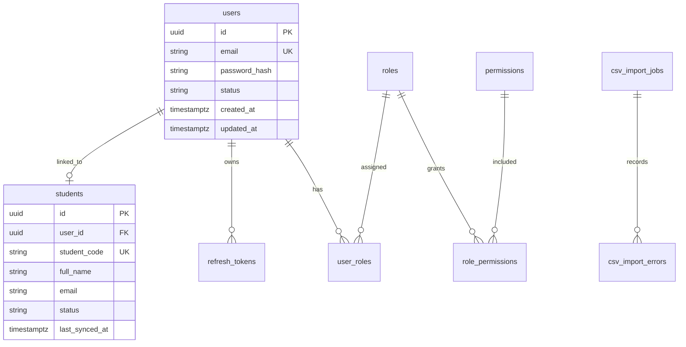
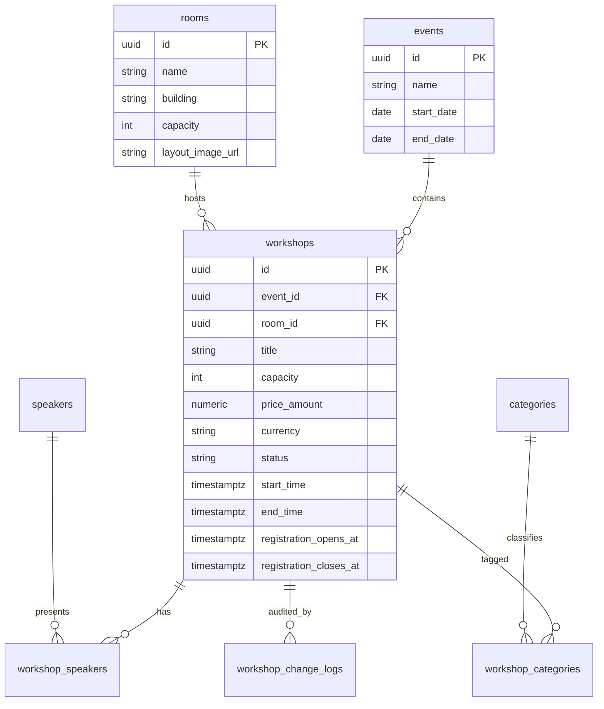
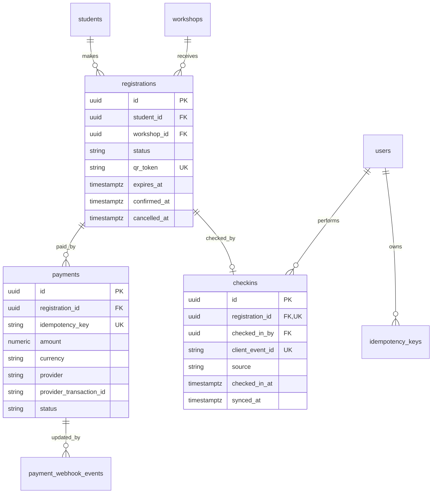
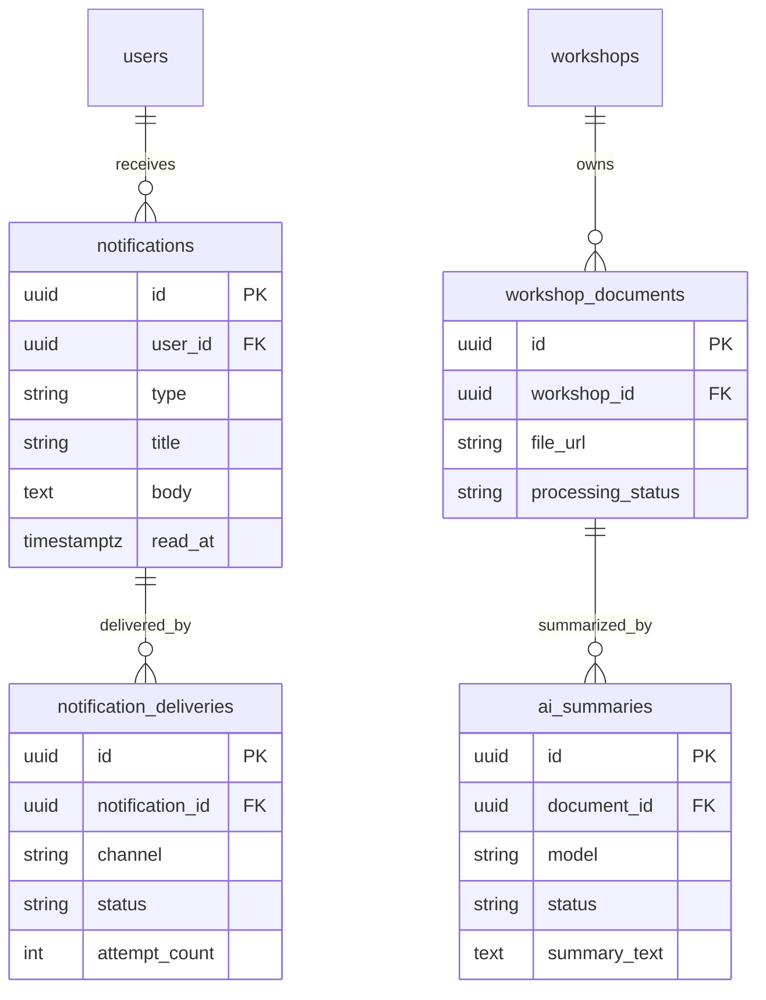
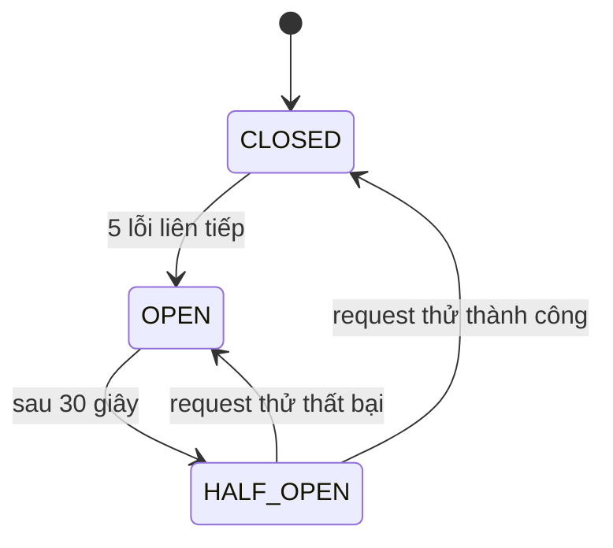
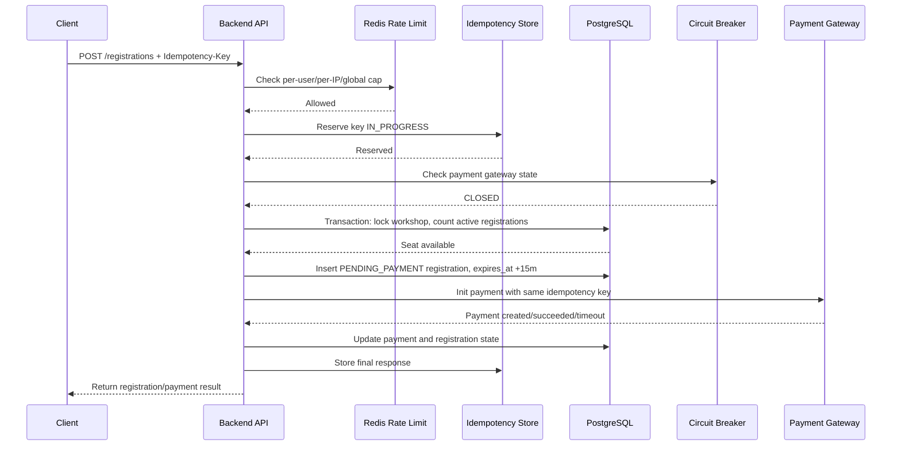

# UniHub Workshop — Technical Design

## T02 — Thiết kế Database & Dữ liệu

### 1. Mục tiêu thiết kế dữ liệu

Thiết kế dữ liệu của UniHub Workshop phải ưu tiên tính đúng đắn của nghiệp vụ đăng ký, khả năng chịu tải khi mở đăng ký, và khả năng phục hồi khi các hệ thống phụ trợ gặp lỗi. Các mục tiêu chính gồm:

- Đảm bảo không xảy ra đăng ký vượt quá số chỗ của workshop, kể cả khi nhiều sinh viên đăng ký đồng thời.
- Lưu được đầy đủ vòng đời đăng ký, thanh toán, check-in và thông báo để phục vụ audit và xử lý lỗi.
- Hỗ trợ nhập dữ liệu sinh viên định kỳ từ file CSV mà không làm gián đoạn hệ thống đang chạy.
- Hỗ trợ check-in offline bằng cách chống trùng dữ liệu khi thiết bị đồng bộ lại nhiều lần.
- Tách dữ liệu nghiệp vụ bền vững khỏi dữ liệu runtime ngắn hạn như rate limit, cache và circuit breaker state.

### 2. Lựa chọn công nghệ lưu trữ

#### PostgreSQL

PostgreSQL được chọn làm cơ sở dữ liệu chính vì hệ thống có nhiều nghiệp vụ cần tính nhất quán mạnh: đăng ký chỗ, thanh toán, check-in, phân quyền và import CSV. Các lý do chính:

- Hỗ trợ transaction ACID để xử lý tranh chấp chỗ ngồi an toàn.
- Hỗ trợ row-level lock bằng `SELECT ... FOR UPDATE` khi nhiều sinh viên đăng ký cùng một workshop.
- Hỗ trợ unique constraint, foreign key, check constraint và partial index để bảo vệ dữ liệu ở tầng database.
- Phù hợp với dữ liệu có quan hệ rõ ràng như sinh viên, workshop, phòng, đăng ký, thanh toán và check-in.
- Có thể lưu metadata linh hoạt bằng `JSONB` cho các dữ liệu như webhook payload, AI metadata, audit metadata.

#### Redis

Redis được chọn làm datastore phụ, không phải nguồn dữ liệu chính. Redis dùng cho các dữ liệu runtime cần tốc độ cao hoặc TTL ngắn:

- Cache số chỗ còn lại theo thời gian thực để giảm tải cho PostgreSQL khi nhiều sinh viên xem danh sách workshop.
- Lưu counter/token bucket cho rate limiting.
- Lưu idempotency cache để phản hồi nhanh các request retry.
- Lưu state của circuit breaker để nhiều backend instance cùng biết trạng thái payment gateway.
- Có thể dùng làm distributed lock phụ trợ, nhưng lớp đảm bảo cuối cùng vẫn là transaction trong PostgreSQL.

#### File storage

Các file PDF giới thiệu workshop, ảnh sơ đồ phòng và file upload khác không lưu trực tiếp trong PostgreSQL. Database chỉ lưu metadata và đường dẫn file. Trong môi trường đồ án có thể dùng thư mục `uploads/` gắn Docker volume; trong production có thể thay bằng S3-compatible storage như MinIO hoặc Amazon S3.

### 3. Nhóm dữ liệu chính

| Nhóm dữ liệu      | Bảng chính                                                                            | Vai trò                                                      |
| ----------------- | ------------------------------------------------------------------------------------- | ------------------------------------------------------------ |
| Auth/RBAC         | `users`, `roles`, `permissions`, `user_roles`, `role_permissions`, `refresh_tokens`   | Đăng nhập, phân quyền, thu hồi phiên đăng nhập               |
| Student directory | `students`, `csv_import_jobs`, `csv_import_errors`                                    | Lưu hồ sơ sinh viên được nhập từ CSV hệ thống cũ             |
| Workshop catalog  | `events`, `rooms`, `speakers`, `categories`, `workshops`, bảng nối                    | Quản lý tuần lễ, phòng, diễn giả, chủ đề và workshop         |
| Registration      | `registrations`, `checkins`                                                           | Đăng ký workshop, sinh QR token, check-in online/offline     |
| Payment           | `payments`, `payment_webhook_events`, `idempotency_keys`                              | Thanh toán workshop có phí, chống retry trùng, xử lý webhook |
| Notification      | `notifications`, `notification_deliveries`, `outbox_events`                           | Thông báo in-app/email và xử lý async an toàn                |
| AI Summary        | `workshop_documents`, `ai_summaries`                                                  | Lưu metadata PDF, trạng thái extract và kết quả tóm tắt AI   |
| Audit/Protection  | `audit_logs`, `workshop_change_logs`, `rate_limit_policies`, `circuit_breaker_events` | Lưu vết thao tác, cấu hình bảo vệ và sự kiện circuit breaker |

### 4. ERD theo domain

#### 4.1 Auth/RBAC và sinh viên



#### 4.2 Workshop catalog



#### 4.3 Đăng ký, thanh toán và check-in



#### 4.4 Notification, outbox và AI Summary



### 5. Thiết kế schema chính

#### 5.1 `users`

| Field                      | Type              | Ghi chú                                                                     |
| -------------------------- | ----------------- | --------------------------------------------------------------------------- |
| `id`                       | UUID              | Primary key                                                                 |
| `email`                    | varchar           | Unique, dùng để đăng nhập                                                   |
| `password_hash`            | varchar, nullable | Lưu hash bằng Argon2id hoặc bcrypt; nullable để hỗ trợ lazy student account |
| `full_name`                | varchar           | Tên hiển thị                                                                |
| `status`                   | varchar           | `ACTIVE`, `DISABLED`                                                        |
| `created_at`, `updated_at` | timestamptz       | Audit thời gian                                                             |

Sinh viên, ban tổ chức và nhân sự check-in đều là `users`. Quyền hạn không lưu trực tiếp bằng một cột `role`, mà thông qua RBAC nhiều bảng.

#### 5.2 `students`

| Field                              | Type              | Ghi chú                                                 |
| ---------------------------------- | ----------------- | ------------------------------------------------------- |
| `id`                               | UUID              | Primary key nội bộ                                      |
| `user_id`                          | UUID, nullable    | Liên kết tới `users.id` khi sinh viên đăng nhập lần đầu |
| `student_code`                     | varchar           | Unique business key, dùng để upsert từ CSV              |
| `full_name`                        | varchar           | Tên sinh viên                                           |
| `email`                            | varchar           | Email sinh viên                                         |
| `faculty`, `major`, `cohort`       | varchar, nullable | Thông tin học vụ tùy chọn                               |
| `status`                           | varchar           | `ACTIVE`, `SUSPENDED`, `GRADUATED`, `DELETED`           |
| `last_synced_at`                   | timestamptz       | Lần cuối được cập nhật từ CSV                           |
| `source_file`, `source_row_number` | varchar/int       | Truy vết dòng dữ liệu import                            |

Chỉ sinh viên có `status = 'ACTIVE'` mới được đăng ký workshop. CSV import chỉ upsert bảng `students`; tài khoản `users` được tạo hoặc liên kết khi sinh viên đăng nhập lần đầu.

#### 5.3 RBAC tables

| Bảng               | Field chính                                               | Vai trò                                                              |
| ------------------ | --------------------------------------------------------- | -------------------------------------------------------------------- |
| `roles`            | `id`, `code`, `name`                                      | Lưu role như `STUDENT`, `ORGANIZER`, `CHECKIN_STAFF`                 |
| `permissions`      | `id`, `code`, `description`                               | Lưu quyền như `workshop:create`, `registration:read`, `checkin:scan` |
| `user_roles`       | `user_id`, `role_id`                                      | Cho phép một user có nhiều role                                      |
| `role_permissions` | `role_id`, `permission_id`                                | Gán quyền cho role                                                   |
| `refresh_tokens`   | `id`, `user_id`, `token_hash`, `expires_at`, `revoked_at` | Hỗ trợ logout và thu hồi phiên                                       |

Thiết kế này giúp phần T03 có thể kiểm tra quyền ở API, admin web và check-in app mà không phải hardcode toàn bộ logic phân quyền.

#### 5.4 `events`

| Field                    | Type    | Ghi chú                                      |
| ------------------------ | ------- | -------------------------------------------- |
| `id`                     | UUID    | Primary key                                  |
| `name`                   | varchar | Ví dụ: `Tuần lễ kỹ năng và nghề nghiệp 2026` |
| `start_date`, `end_date` | date    | Khoảng thời gian 5 ngày                      |
| `status`                 | varchar | `DRAFT`, `ACTIVE`, `COMPLETED`               |

Bảng `events` giúp hệ thống không bị khóa vào một kỳ tổ chức duy nhất. Mỗi năm hoặc mỗi học kỳ có thể tạo một event mới.

#### 5.5 `rooms`

| Field              | Type                  | Ghi chú                   |
| ------------------ | --------------------- | ------------------------- |
| `id`               | UUID                  | Primary key               |
| `name`             | varchar               | Tên phòng                 |
| `building`         | varchar               | Tòa nhà                   |
| `floor`            | varchar/int           | Tầng                      |
| `capacity`         | int                   | Sức chứa vật lý của phòng |
| `layout_image_url` | varchar               | Đường dẫn sơ đồ phòng     |
| `deleted_at`       | timestamptz, nullable | Soft delete               |

Rule nghiệp vụ `workshops.capacity <= rooms.capacity` được kiểm tra ở service/API khi tạo hoặc cập nhật workshop.

#### 5.6 `workshops`

| Field                                             | Type                  | Ghi chú                                        |
| ------------------------------------------------- | --------------------- | ---------------------------------------------- |
| `id`                                              | UUID                  | Primary key                                    |
| `event_id`                                        | UUID                  | FK tới `events`                                |
| `room_id`                                         | UUID                  | FK tới `rooms`                                 |
| `title`                                           | varchar               | Tên workshop                                   |
| `description`                                     | text                  | Mô tả chi tiết                                 |
| `capacity`                                        | int                   | Số chỗ đăng ký, không vượt sức chứa phòng      |
| `price_amount`                                    | numeric               | `0` nghĩa là miễn phí                          |
| `currency`                                        | varchar               | Ví dụ: `VND`                                   |
| `status`                                          | varchar               | `DRAFT`, `PUBLISHED`, `CANCELLED`, `COMPLETED` |
| `start_time`, `end_time`                          | timestamptz           | Thời gian diễn ra                              |
| `registration_opens_at`, `registration_closes_at` | timestamptz           | Thời gian mở/đóng đăng ký                      |
| `created_by`, `updated_by`                        | UUID                  | FK tới `users`                                 |
| `deleted_at`                                      | timestamptz, nullable | Soft delete                                    |

Sinh viên chỉ được xem và đăng ký workshop có `status = 'PUBLISHED'` và đang trong khoảng thời gian đăng ký. Khi tạo hoặc đổi lịch workshop, service kiểm tra không có workshop khác dùng cùng phòng trùng thời gian.

#### 5.7 `speakers`, `categories` và bảng nối

| Bảng                  | Field chính                                                                   | Vai trò                            |
| --------------------- | ----------------------------------------------------------------------------- | ---------------------------------- |
| `speakers`            | `id`, `full_name`, `title`, `organization`, `bio`, `avatar_url`, `deleted_at` | Lưu diễn giả                       |
| `workshop_speakers`   | `workshop_id`, `speaker_id`, `display_order`                                  | Một workshop có nhiều diễn giả     |
| `categories`          | `id`, `name`, `slug`                                                          | Chủ đề như CV, Interview, Data, AI |
| `workshop_categories` | `workshop_id`, `category_id`                                                  | Một workshop có nhiều chủ đề       |

Thiết kế bảng nối giúp tránh lặp thông tin diễn giả và hỗ trợ lọc workshop theo chủ đề.

#### 5.8 `registrations`

| Field                                           | Type                  | Ghi chú                                                |
| ----------------------------------------------- | --------------------- | ------------------------------------------------------ |
| `id`                                            | UUID                  | Primary key                                            |
| `student_id`                                    | UUID                  | FK tới `students`                                      |
| `workshop_id`                                   | UUID                  | FK tới `workshops`                                     |
| `status`                                        | varchar               | `PENDING_PAYMENT`, `CONFIRMED`, `CANCELLED`, `EXPIRED` |
| `qr_token`                                      | varchar               | Unique, random/signed token dùng để sinh QR            |
| `expires_at`                                    | timestamptz, nullable | Hạn giữ chỗ cho đăng ký đang chờ thanh toán            |
| `confirmed_at`                                  | timestamptz, nullable | Thời điểm xác nhận đăng ký                             |
| `cancelled_at`, `cancelled_by`, `cancel_reason` | nullable              | Lưu thông tin hủy                                      |
| `created_at`, `updated_at`                      | timestamptz           | Audit thời gian                                        |

Workshop miễn phí tạo registration `CONFIRMED` ngay nếu còn chỗ. Workshop có phí tạo registration `PENDING_PAYMENT` và giữ chỗ tối đa 15 phút. Nếu quá hạn chưa thanh toán, worker chuyển trạng thái sang `EXPIRED` để trả chỗ.

Các registration được tính là đang chiếm chỗ gồm `CONFIRMED` và `PENDING_PAYMENT` chưa hết hạn. Hệ thống cho phép sinh viên đăng ký lại sau khi registration cũ đã `CANCELLED` hoặc `EXPIRED`.

#### 5.9 `payments`

| Field                     | Type              | Ghi chú                                                                           |
| ------------------------- | ----------------- | --------------------------------------------------------------------------------- |
| `id`                      | UUID              | Primary key                                                                       |
| `registration_id`         | UUID              | FK tới `registrations`                                                            |
| `idempotency_key`         | varchar           | Unique, chống client retry tạo giao dịch mới                                      |
| `amount`                  | numeric           | Số tiền                                                                           |
| `currency`                | varchar           | Loại tiền                                                                         |
| `provider`                | varchar           | Ví dụ: `MOCK_GATEWAY`                                                             |
| `provider_transaction_id` | varchar, nullable | Mã giao dịch từ gateway                                                           |
| `status`                  | varchar           | `INITIATED`, `PENDING`, `SUCCEEDED`, `FAILED`, `TIMEOUT`, `CANCELLED`, `REFUNDED` |
| `requested_at`, `paid_at` | timestamptz       | Mốc thời gian thanh toán                                                          |

Bảng `payments` tách khỏi `registrations` để lưu được retry, timeout, callback và audit thanh toán. Luồng refund đầy đủ không thuộc phạm vi chính, nhưng status `REFUNDED` được chuẩn bị để hỗ trợ hủy workshop sau này.

#### 5.10 `idempotency_keys`

| Field           | Type        | Ghi chú                                           |
| --------------- | ----------- | ------------------------------------------------- |
| `id`            | UUID        | Primary key                                       |
| `key`           | varchar     | Unique key do client gửi                          |
| `user_id`       | UUID        | Chủ request                                       |
| `endpoint`      | varchar     | API được bảo vệ                                   |
| `request_hash`  | varchar     | Hash body request để phát hiện retry khác payload |
| `response_body` | JSONB       | Response đã trả trước đó                          |
| `status_code`   | int         | HTTP status đã trả                                |
| `expires_at`    | timestamptz | Thời hạn lưu key                                  |
| `created_at`    | timestamptz | Thời điểm tạo                                     |

PostgreSQL lưu idempotency bền vững, Redis cache response để tăng tốc khi client retry liên tục.

#### 5.11 `payment_webhook_events`

| Field                         | Type           | Ghi chú                                      |
| ----------------------------- | -------------- | -------------------------------------------- |
| `id`                          | UUID           | Primary key                                  |
| `provider`                    | varchar        | Payment provider                             |
| `event_id`                    | varchar        | Mã event từ provider                         |
| `payment_id`                  | UUID, nullable | FK tới `payments` nếu match được             |
| `payload`                     | JSONB          | Raw payload                                  |
| `status`                      | varchar        | `RECEIVED`, `PROCESSED`, `FAILED`, `IGNORED` |
| `received_at`, `processed_at` | timestamptz    | Mốc xử lý                                    |

Unique constraint `(provider, event_id)` giúp webhook từ gateway có thể gửi lại nhiều lần mà server chỉ xử lý một lần.

#### 5.12 `checkins`

| Field             | Type                  | Ghi chú                          |
| ----------------- | --------------------- | -------------------------------- |
| `id`              | UUID                  | Primary key                      |
| `registration_id` | UUID                  | Unique FK tới `registrations`    |
| `checked_in_by`   | UUID                  | FK tới `users`, nhân sự check-in |
| `client_event_id` | varchar               | Unique ID do app offline sinh ra |
| `source`          | varchar               | `ONLINE`, `OFFLINE_SYNC`         |
| `checked_in_at`   | timestamptz           | Thời điểm quét trên thiết bị     |
| `synced_at`       | timestamptz, nullable | Thời điểm server nhận sync       |
| `device_id`       | varchar, nullable     | Thiết bị thực hiện check-in      |

Unique `registration_id` đảm bảo một registration chỉ check-in thành công một lần. Unique `client_event_id` đảm bảo app offline có thể retry sync mà không tạo bản ghi trùng.

#### 5.13 CSV import tables

| Bảng                | Field chính                                                                                                            | Vai trò                               |
| ------------------- | ---------------------------------------------------------------------------------------------------------------------- | ------------------------------------- |
| `csv_import_jobs`   | `id`, `file_name`, `file_checksum`, `status`, `total_rows`, `success_rows`, `failed_rows`, `started_at`, `finished_at` | Lưu trạng thái mỗi lần import CSV     |
| `csv_import_errors` | `id`, `job_id`, `row_number`, `raw_data`, `error_code`, `error_message`                                                | Lưu từng dòng lỗi để job vẫn tiếp tục |

CSV import dùng `student_code` làm business key để upsert sinh viên. Dòng lỗi bị ghi vào `csv_import_errors` và không làm chết toàn bộ job.

#### 5.14 Notification và outbox

| Bảng                      | Field chính                                                                                               | Vai trò                                               |
| ------------------------- | --------------------------------------------------------------------------------------------------------- | ----------------------------------------------------- |
| `notifications`           | `id`, `user_id`, `type`, `title`, `body`, `data`, `read_at`, `created_at`                                 | Lưu thông báo in-app                                  |
| `notification_deliveries` | `id`, `notification_id`, `channel`, `status`, `attempt_count`, `last_error`, `sent_at`                    | Theo dõi gửi email/in-app và mở rộng Telegram sau này |
| `outbox_events`           | `id`, `event_type`, `aggregate_type`, `aggregate_id`, `payload`, `status`, `available_at`, `processed_at` | Transactional outbox cho xử lý async                  |

Khi registration được xác nhận, transaction ghi cả registration và `outbox_events`. Worker xử lý outbox để gửi email/in-app. Nếu email lỗi, registration vẫn không bị rollback.

#### 5.15 AI Summary tables

| Bảng                 | Field chính                                                                                                                    | Vai trò                                   |
| -------------------- | ------------------------------------------------------------------------------------------------------------------------------ | ----------------------------------------- |
| `workshop_documents` | `id`, `workshop_id`, `file_url`, `file_name`, `mime_type`, `file_size`, `processing_status`, `extracted_text`, `error_message` | Lưu metadata PDF và trạng thái extract    |
| `ai_summaries`       | `id`, `document_id`, `model`, `prompt_version`, `status`, `summary_text`, `error_message`, `created_at`                        | Lưu kết quả tóm tắt AI và thông tin model |

Tách document và summary giúp hệ thống retry extract hoặc retry AI mà không mất metadata file gốc.

#### 5.16 Audit và protection tables

| Bảng                     | Field chính                                                                                             | Vai trò                                       |
| ------------------------ | ------------------------------------------------------------------------------------------------------- | --------------------------------------------- |
| `audit_logs`             | `id`, `actor_user_id`, `action`, `resource_type`, `resource_id`, `metadata`, `ip_address`, `created_at` | Lưu vết thao tác nhạy cảm                     |
| `workshop_change_logs`   | `id`, `workshop_id`, `field_name`, `old_value`, `new_value`, `changed_by`, `reason`, `changed_at`       | Lưu lịch sử đổi phòng, đổi giờ, hủy workshop  |
| `rate_limit_policies`    | `id`, `scope`, `endpoint`, `role_code`, `limit_value`, `window_seconds`, `algorithm`, `enabled`         | Lưu cấu hình rate limit nếu cần thay đổi động |
| `circuit_breaker_events` | `id`, `service_name`, `from_state`, `to_state`, `reason`, `failure_count`, `created_at`                 | Audit trạng thái circuit breaker              |

Runtime rate limit và circuit breaker state lưu trong Redis. PostgreSQL chỉ lưu policy và event log để phục vụ audit/demo.

### 6. Constraint và index quan trọng

| Mục tiêu                            | Constraint/Index                                                                |
| ----------------------------------- | ------------------------------------------------------------------------------- |
| Upsert sinh viên từ CSV             | Unique index `students(student_code)`                                           |
| Đăng nhập bằng email                | Unique index `users(email)`                                                     |
| Chống duplicate registration active | Partial unique index `registrations(student_id, workshop_id)` với status active |
| Đếm chỗ còn lại nhanh               | Index `registrations(workshop_id, status, expires_at)`                          |
| Validate QR nhanh                   | Unique index `registrations(qr_token)`                                          |
| Chống check-in trùng                | Unique index `checkins(registration_id)`                                        |
| Chống offline sync trùng            | Unique index `checkins(client_event_id)`                                        |
| Chống payment retry                 | Unique index `payments(idempotency_key)`                                        |
| Replay idempotent response          | Unique index `idempotency_keys(key)`                                            |
| Chống webhook trùng                 | Unique index `payment_webhook_events(provider, event_id)`                       |
| Xem lịch workshop                   | Index `workshops(event_id, start_time, status)`                                 |
| Lọc workshop theo phòng/thời gian   | Index `workshops(room_id, start_time, end_time)`                                |
| Worker xử lý outbox                 | Index `outbox_events(status, available_at)`                                     |
| Worker expire pending payment       | Index `registrations(status, expires_at)`                                       |

Partial unique index cho registration active có thể định nghĩa logic như sau:

```sql
CREATE UNIQUE INDEX uq_active_registration
ON registrations(student_id, workshop_id)
WHERE status IN ('PENDING_PAYMENT', 'CONFIRMED');
```

Khi kiểm tra capacity, `PENDING_PAYMENT` chỉ được tính là active nếu `expires_at > now()`. Worker định kỳ chuyển các bản ghi quá hạn sang `EXPIRED`, nhờ đó partial unique index không chặn sinh viên đăng ký lại sau khi hết hạn.

### 7. Cách schema hỗ trợ các vấn đề kỹ thuật chính

#### 7.1 Chống tranh chấp chỗ ngồi

Luồng đăng ký dùng transaction trong PostgreSQL:

```sql
BEGIN;
SELECT * FROM workshops WHERE id = :workshop_id FOR UPDATE;
SELECT COUNT(*) FROM registrations
WHERE workshop_id = :workshop_id
AND (
    status = 'CONFIRMED'
    OR (status = 'PENDING_PAYMENT' AND expires_at > now())
);
-- Nếu count < capacity thì insert registration
COMMIT;
```

Row lock trên `workshops` đảm bảo tại một thời điểm chỉ một transaction được quyết định còn chỗ hay không cho cùng workshop. Đây là lớp bảo vệ chính để không overbook.

#### 7.2 Hiển thị số chỗ còn lại realtime

Nguồn dữ liệu đúng là PostgreSQL: `capacity - active_registration_count`. Để giảm tải khi 12.000 sinh viên xem lịch, backend cache kết quả trong Redis với TTL ngắn hoặc cập nhật cache sau mỗi registration thành công/hết hạn.

#### 7.3 Thanh toán an toàn và chống trừ tiền hai lần

`idempotency_keys` lưu request và response đã xử lý. `payments.idempotency_key` đảm bảo cùng một thao tác thanh toán không tạo nhiều giao dịch. `payment_webhook_events(provider, event_id)` đảm bảo callback từ gateway có thể retry mà không bị xử lý lặp.

#### 7.4 Check-in offline

Mobile/PWA tạo `client_event_id` cho mỗi lần quét QR offline. Khi sync lại, server insert vào `checkins`. Nếu cùng event được gửi lại, unique `client_event_id` giúp server trả kết quả cũ thay vì tạo bản ghi mới. Nếu một registration đã được check-in bởi thiết bị khác, unique `registration_id` giúp phát hiện conflict.

#### 7.5 CSV import fault tolerance

Mỗi file CSV tạo một `csv_import_jobs`. Mỗi dòng hợp lệ được upsert vào `students` theo `student_code`. Mỗi dòng lỗi được ghi vào `csv_import_errors`, job vẫn tiếp tục xử lý các dòng còn lại. Checksum file giúp phát hiện import trùng file nếu cần.

#### 7.6 AI Summary async

Upload PDF tạo `workshop_documents` với `processing_status = 'PENDING'`. Worker extract text và gọi AI model. Kết quả lưu vào `ai_summaries`. Nếu extract hoặc AI lỗi, trạng thái chuyển `FAILED` cùng `error_message`, không ảnh hưởng đến chức năng xem và đăng ký workshop.

### 8. Trade-off và phạm vi không làm

- Không dùng MongoDB vì dữ liệu nghiệp vụ chính có quan hệ chặt và cần transaction mạnh.
- Không lưu binary PDF/ảnh trong PostgreSQL để tránh database phình to và khó backup.
- Không triển khai waitlist vì đề bài chỉ yêu cầu không overbook, không yêu cầu danh sách chờ.
- Không dùng partitioning trong phạm vi đồ án vì quy mô dự kiến chưa đủ lớn; index đúng và Redis cache là đủ.
- Không lưu `remaining_seats` như nguồn dữ liệu chính vì dễ lệch khi rollback hoặc lỗi giữa chừng.
- Không dùng PostgreSQL enum cho status; dùng `varchar` kèm check constraint để migration linh hoạt hơn trong quá trình phát triển.

## T04 — Thiết kế Cơ chế bảo vệ hệ thống

### 1. Mục tiêu và rủi ro cần xử lý

UniHub Workshop phải hoạt động ổn định trong thời điểm mở đăng ký, khi có khoảng 12.000 sinh viên truy cập trong 10 phút đầu và 60% lưu lượng dồn vào 3 phút đầu tiên. Ngoài tải đột biến, hệ thống còn phải xử lý an toàn các lỗi từ cổng thanh toán và các request retry do mạng chập chờn.

T04 tập trung vào ba cơ chế chính:

- **Rate Limiting:** bảo vệ backend API khỏi spam request và giảm khả năng một số sinh viên chiếm lợi thế bằng cách gửi request liên tục.
- **Circuit Breaker:** cô lập lỗi từ payment gateway để sự cố thanh toán không kéo sập các chức năng khác như xem lịch workshop hoặc đăng ký workshop miễn phí.
- **Idempotency Key:** đảm bảo một thao tác đăng ký/thanh toán chỉ được xử lý đúng một lần dù client retry nhiều lần.

Ba cơ chế này không thay thế kiểm soát dữ liệu ở PostgreSQL. Chống overbook vẫn dựa trên transaction và row lock ở database; rate limiting chỉ giúp giảm tải và tăng tính công bằng tương đối.

### 2. Rate Limiting chống tải đột biến

#### 2.1 Lựa chọn thuật toán

Hệ thống dùng **Token Bucket trên Redis** cho các endpoint quan trọng. Token Bucket phù hợp với bài toán mở đăng ký vì cho phép một lượng burst ngắn trong thời điểm sinh viên bấm đăng ký, nhưng vẫn giới hạn tốc độ request lâu dài.

So sánh với các lựa chọn khác:

| Thuật toán     | Nhận xét                                                                               |
| -------------- | -------------------------------------------------------------------------------------- |
| Fixed Window   | Dễ triển khai nhưng có thể bị burst gấp đôi ở ranh giới cửa sổ thời gian               |
| Sliding Window | Chính xác hơn Fixed Window nhưng tốn nhiều bộ nhớ/operation hơn khi số user lớn        |
| Leaky Bucket   | Làm mượt request tốt nhưng tăng latency và phức tạp nếu dùng cho API realtime          |
| Token Bucket   | Cân bằng tốt giữa khả năng chịu burst, đơn giản triển khai và hiệu năng cao trên Redis |

#### 2.2 Phạm vi áp dụng

Rate limiting được áp dụng theo nhiều lớp:

| Lớp                     | Mục tiêu                                                       | Ví dụ Redis key                         |
| ----------------------- | -------------------------------------------------------------- | --------------------------------------- |
| Per-user                | Ngăn sinh viên đã đăng nhập spam API                           | `rl:user:{user_id}:POST:/registrations` |
| Per-IP                  | Bảo vệ các endpoint public hoặc request chưa đăng nhập         | `rl:ip:{ip}:POST:/auth/login`           |
| Per-endpoint/global cap | Bảo vệ backend khi tổng request hợp lệ vẫn vượt khả năng xử lý | `rl:global:POST:/registrations`         |

Không dùng per-IP làm cơ chế duy nhất vì nhiều sinh viên có thể dùng chung Wi-Fi hoặc NAT của trường. Không dùng per-user làm cơ chế duy nhất vì không bảo vệ được các endpoint trước khi đăng nhập.

#### 2.3 Chính sách giới hạn đề xuất

Endpoint nhạy cảm nhất là `POST /registrations`. Chính sách đề xuất rộng hơn mức chặt ban đầu khoảng 1.5 lần để tránh ảnh hưởng sinh viên bình thường:

| Endpoint              | Scope           | Burst                 | Refill/Window       | Mục tiêu                                        |
| --------------------- | --------------- | --------------------- | ------------------- | ----------------------------------------------- |
| `POST /registrations` | Per-user        | 5 requests            | 1 token mỗi 3 giây  | Chặn spam click đăng ký                         |
| `POST /registrations` | Per-IP          | 90 requests/phút      | Window 60 giây      | Chặn bot hoặc NAT bất thường                    |
| `POST /registrations` | Global endpoint | 300-500 requests/giây | Window 1 giây       | Load shedding khi tổng tải quá cao              |
| `POST /payments`      | Per-user        | 3 requests            | 1 token mỗi 10 giây | Tránh spam tạo giao dịch thanh toán             |
| `POST /auth/login`    | Per-IP          | 20 requests/phút      | Window 60 giây      | Giảm brute force login                          |
| `GET /workshops`      | Per-IP          | 300 requests/phút     | Window 60 giây      | Bảo vệ API đọc nhưng vẫn cho xem lịch thoải mái |

Các con số trên là baseline cho đồ án và có thể cấu hình qua `rate_limit_policies`. Runtime counter vẫn lưu trong Redis, không ghi từng request vào PostgreSQL.

#### 2.4 Cách hoạt động của Token Bucket

Mỗi bucket lưu các thông tin:

| Field            | Ý nghĩa                      |
| ---------------- | ---------------------------- |
| `tokens`         | Số token còn lại             |
| `last_refill_at` | Thời điểm refill gần nhất    |
| `capacity`       | Số token tối đa trong bucket |
| `refill_rate`    | Tốc độ hồi token             |

Khi request đến, middleware rate limiter thực hiện:

1. Xác định identity: user ID nếu đã đăng nhập, IP nếu chưa đăng nhập, endpoint hiện tại.
2. Đọc bucket từ Redis.
3. Tính số token cần refill dựa trên thời gian đã trôi qua.
4. Nếu còn token, trừ 1 token và cho request đi tiếp.
5. Nếu hết token, chặn request và trả `HTTP 429`.

Để tránh race condition khi nhiều request cùng cập nhật bucket, thao tác đọc, refill và trừ token nên chạy bằng Redis Lua script hoặc Redis transaction.

#### 2.5 Response khi bị giới hạn

Khi request bị rate limit, API trả `HTTP 429 Too Many Requests` kèm header:

```http
HTTP/1.1 429 Too Many Requests
Retry-After: 3
X-RateLimit-Limit: 5
X-RateLimit-Remaining: 0
X-RateLimit-Reset: 2026-04-28T10:15:30Z
```

Body response:

```json
{
    "error": "RATE_LIMITED",
    "message": "Bạn đang gửi yêu cầu quá nhanh. Vui lòng thử lại sau vài giây.",
    "retryAfterSeconds": 3
}
```

Frontend dùng `Retry-After` để tạm khóa nút đăng ký, tránh client tự retry liên tục.

#### 2.6 Công bằng và giới hạn thiết kế

Rate limiting trong hệ thống đảm bảo **công bằng tương đối**, không phải công bằng tuyệt đối. Per-user token bucket giúp sinh viên spam click không có lợi thế lớn hơn sinh viên bấm bình thường. Tuy nhiên hệ thống không triển khai virtual waiting room hoặc queue chính thức, nên không cam kết thứ tự tuyệt đối giữa mọi sinh viên.

#### 2.7 Khi Redis gặp lỗi

Nếu Redis gặp lỗi, rate limiter dùng chiến lược **fail-open + local fallback**:

- API đọc như `GET /workshops` được fail-open để sinh viên vẫn xem lịch.
- API nhạy cảm như `POST /registrations` dùng local in-memory limiter tạm thời với giới hạn bảo thủ hơn.
- Hệ thống ghi log/metric cảnh báo Redis lỗi, nhưng không ghi từng request bị limit vào PostgreSQL.

Chiến lược này tránh việc Redis lỗi làm toàn bộ hệ thống không dùng được, đồng thời vẫn giữ một lớp bảo vệ tối thiểu cho endpoint đăng ký.

### 3. Circuit Breaker cho payment gateway

#### 3.1 Mục tiêu

Cổng thanh toán có thể timeout hoặc lỗi kéo dài. Nếu backend tiếp tục gọi gateway ở mọi request, hệ thống sẽ bị giữ connection, tăng latency và có thể làm hỏng cả các chức năng không liên quan thanh toán. Circuit Breaker được dùng để phát hiện payment gateway đang lỗi và tạm thời ngừng gọi gateway.

Circuit breaker áp dụng chính cho **payment gateway**. Với AI Summary, hệ thống có thể áp dụng cùng pattern ở worker xử lý PDF, nhưng AI không phải trọng tâm của cơ chế bảo vệ trong T04.

#### 3.2 State machine

Circuit breaker có ba trạng thái:

| Trạng thái  | Hành vi                                                                                           |
| ----------- | ------------------------------------------------------------------------------------------------- |
| `CLOSED`    | Gateway được xem là bình thường. Request payment được gọi trực tiếp.                              |
| `OPEN`      | Gateway được xem là lỗi. Backend không gọi gateway và trả lỗi có kiểm soát cho paid registration. |
| `HALF_OPEN` | Sau thời gian nghỉ, backend cho một request thử đi qua để kiểm tra gateway đã hồi phục chưa.      |



#### 3.3 Ngưỡng chuyển trạng thái

| Tham số           | Giá trị thiết kế    | Lý do                                                      |
| ----------------- | ------------------- | ---------------------------------------------------------- |
| Failure threshold | 5 lỗi liên tiếp     | Dễ demo, dễ hiểu, đủ để tránh mở circuit vì một lỗi đơn lẻ |
| Open duration     | 30 giây             | Đủ ngắn để demo phục hồi, đủ dài để không spam gateway lỗi |
| Half-open trial   | 1 request           | Tránh nhiều request cùng đánh vào gateway vừa hồi phục     |
| Payment timeout   | 3 giây              | Không giữ request backend quá lâu                          |
| Retry             | Tối đa 1 retry ngắn | Xử lý lỗi mạng thoáng qua nhưng không khuếch đại sự cố     |

Các lỗi được tính vào failure count gồm timeout, HTTP 5xx từ gateway, connection refused và lỗi network. Lỗi nghiệp vụ như thẻ không hợp lệ hoặc user hủy thanh toán không được tính là lỗi hệ thống của gateway.

#### 3.4 Lưu trạng thái

Runtime state của circuit breaker lưu trong Redis để nhiều backend instance cùng nhìn thấy một trạng thái:

| Redis key                           | Nội dung                               |
| ----------------------------------- | -------------------------------------- |
| `cb:payment_gateway:state`          | `CLOSED`, `OPEN`, `HALF_OPEN`          |
| `cb:payment_gateway:failure_count`  | Số lỗi liên tiếp                       |
| `cb:payment_gateway:opened_until`   | Thời điểm được chuyển sang `HALF_OPEN` |
| `cb:payment_gateway:half_open_lock` | Lock để chỉ một request thử đi qua     |

PostgreSQL chỉ lưu lịch sử chuyển trạng thái trong `circuit_breaker_events` để audit và demo:

| Field                    | Ý nghĩa                     |
| ------------------------ | --------------------------- |
| `service_name`           | Ví dụ: `payment_gateway`    |
| `from_state`, `to_state` | Trạng thái trước và sau     |
| `reason`                 | Lý do chuyển trạng thái     |
| `failure_count`          | Số lỗi tại thời điểm chuyển |
| `created_at`             | Thời điểm ghi nhận          |

#### 3.5 Graceful degradation khi payment lỗi

Khi circuit breaker ở trạng thái `OPEN`:

- Sinh viên vẫn xem được danh sách workshop và chi tiết workshop.
- Workshop miễn phí vẫn đăng ký được bình thường.
- Workshop có phí trả `HTTP 503 PAYMENT_UNAVAILABLE`.
- Backend không tạo payment mới và không gọi payment gateway.
- Backend không giữ chỗ mới cho paid registration để tránh kẹt slot hàng loạt khi gateway lỗi kéo dài.

Response mẫu:

```json
{
    "error": "PAYMENT_UNAVAILABLE",
    "message": "Cổng thanh toán đang tạm thời gián đoạn. Vui lòng thử lại sau ít phút.",
    "retryAfterSeconds": 30
}
```

#### 3.6 Xử lý timeout sau khi đã giữ chỗ

Trong luồng paid registration, nếu circuit đang `CLOSED`, hệ thống tạo registration `PENDING_PAYMENT` giữ chỗ 15 phút rồi mới gọi gateway. Nếu gọi gateway timeout sau khi đã giữ chỗ, hệ thống không expire registration ngay vì timeout không chứng minh thanh toán chắc chắn thất bại.

Registration giữ trạng thái `PENDING_PAYMENT` đến TTL 15 phút:

- Nếu webhook/payment status báo thành công trong thời gian này, registration chuyển `CONFIRMED`.
- Nếu hết TTL không có kết quả thành công, worker chuyển registration sang `EXPIRED` để trả chỗ.
- Client có thể retry kiểm tra kết quả bằng cùng idempotency key hoặc gọi endpoint tra cứu trạng thái payment.

### 4. Idempotency Key chống double charge

#### 4.1 Mục tiêu

Idempotency Key đảm bảo cùng một ý định thao tác chỉ được xử lý một lần. Cơ chế này đặc biệt quan trọng với workshop có phí, vì client có thể retry khi mạng yếu, request timeout hoặc user bấm lại nút thanh toán.

Idempotency được áp dụng cho:

| Endpoint/Luồng                                 | Cách áp dụng                                                           |
| ---------------------------------------------- | ---------------------------------------------------------------------- |
| `POST /registrations`                          | Bảo vệ thao tác tạo registration, gồm cả workshop miễn phí và có phí   |
| `POST /payments` hoặc `POST /payments/confirm` | Bảo vệ thao tác tạo/xác nhận payment                                   |
| Payment webhook                                | Dùng unique `(provider, event_id)` để callback được xử lý đúng một lần |

#### 4.2 Cách sinh và gửi key

Client sinh UUID v4 cho mỗi ý định thao tác và gửi qua header:

```http
Idempotency-Key: 6f4f23b7-9b24-4a3b-a93d-1c3c2f9792b7
```

Quy tắc phía client:

- Nếu user retry cùng một thao tác, giữ nguyên `Idempotency-Key`.
- Nếu user bắt đầu thao tác mới, sinh key mới.
- Không sinh key từ `student_id` hoặc `workshop_id` vì dễ đoán và không phân biệt được nhiều lần thử hợp lệ.

#### 4.3 Dữ liệu lưu trữ

Idempotency key được lưu bền trong PostgreSQL và cache trong Redis trong 1 giờ.

| Field           | Ý nghĩa                              |
| --------------- | ------------------------------------ |
| `key`           | UUID v4 do client gửi                |
| `user_id`       | User sở hữu request                  |
| `endpoint`      | Endpoint áp dụng idempotency         |
| `request_hash`  | Hash của request body                |
| `status`        | `IN_PROGRESS`, `COMPLETED`, `FAILED` |
| `response_body` | Response đã trả cho request đầu tiên |
| `status_code`   | HTTP status của response đầu tiên    |
| `expires_at`    | Thời điểm hết hạn, mặc định 1 giờ    |

Redis dùng key dạng:

```text
idem:{user_id}:{endpoint}:{idempotency_key}
```

Redis giúp replay response nhanh khi client retry liên tục. PostgreSQL là nguồn dữ liệu bền vững để không mất đảm bảo idempotency nếu Redis restart.

#### 4.4 Luồng xử lý idempotency

Middleware idempotency chạy trước nghiệp vụ chính:

1. Kiểm tra header `Idempotency-Key`.
2. Tính `request_hash` từ method, endpoint và body.
3. Reserve key bằng unique insert với trạng thái `IN_PROGRESS`.
4. Nếu insert thành công, cho request đi vào business logic.
5. Nếu key đã tồn tại và `request_hash` giống nhau, xử lý theo trạng thái hiện có.
6. Nếu key đã tồn tại nhưng `request_hash` khác nhau, trả `409 Conflict`.
7. Sau khi business logic hoàn tất, lưu response vào `idempotency_keys` và Redis.

#### 4.5 Replay policy

| Tình huống                                                        | Response                                                  |
| ----------------------------------------------------------------- | --------------------------------------------------------- |
| Key mới                                                           | Reserve `IN_PROGRESS`, xử lý request                      |
| Key cũ, cùng request, đã `COMPLETED`                              | Trả lại response cũ                                       |
| Key cũ, body khác                                                 | `409 IDEMPOTENCY_KEY_REUSED_WITH_DIFFERENT_REQUEST`       |
| Key cũ đang `IN_PROGRESS`                                         | `409 REQUEST_IN_PROGRESS` kèm `Retry-After`               |
| Request đầu tiên trả business failure ổn định                     | Replay business failure đó                                |
| Request đầu tiên gặp lỗi 500 transient trước khi hoàn tất an toàn | Không replay như kết quả cuối cùng; client được retry sau |

Business failure ổn định gồm hết chỗ, ngoài thời gian đăng ký, sinh viên không hợp lệ hoặc payment circuit đang open. Các lỗi này có thể replay vì retry cùng thao tác không nên tạo kết quả khác ngay lập tức.

Response khi request trước đang xử lý:

```http
HTTP/1.1 409 Conflict
Retry-After: 2
```

```json
{
    "error": "REQUEST_IN_PROGRESS",
    "message": "Yêu cầu trước đó với Idempotency-Key này vẫn đang được xử lý. Vui lòng thử lại sau."
}
```

Response khi cùng key nhưng request khác body:

```json
{
    "error": "IDEMPOTENCY_KEY_REUSED_WITH_DIFFERENT_REQUEST",
    "message": "Idempotency-Key này đã được dùng cho một request khác."
}
```

#### 4.6 Webhook idempotency

Payment gateway có thể gửi lại webhook nhiều lần. Hệ thống xử lý idempotent bằng unique constraint trên `(provider, event_id)` trong bảng `payment_webhook_events`.

Luồng xử lý:

1. Nhận webhook từ gateway.
2. Insert `payment_webhook_events(provider, event_id, payload)`.
3. Nếu insert fail do duplicate, trả `200 OK` vì event đã được nhận trước đó.
4. Nếu insert thành công, xử lý cập nhật `payments` và `registrations` trong transaction.
5. Cập nhật webhook event sang `PROCESSED` hoặc `FAILED`.

### 5. Cách phối hợp trong luồng paid registration

#### 5.1 Thứ tự middleware

Các cơ chế được chạy theo thứ tự:

```text
Auth -> RBAC -> Rate Limit -> Idempotency -> Business Transaction -> Outbox/Response Cache
```

Vai trò từng lớp:

| Lớp                   | Vai trò                                               |
| --------------------- | ----------------------------------------------------- |
| Auth                  | Xác định user đang gửi request                        |
| RBAC                  | Kiểm tra user có quyền đăng ký workshop               |
| Rate Limit            | Chặn request spam trước khi chạm business transaction |
| Idempotency           | Reserve key để chống retry chạy song song             |
| Business Transaction  | Kiểm tra chỗ, giữ chỗ, tạo registration/payment       |
| Outbox/Response Cache | Ghi event gửi thông báo và lưu response để replay     |

Circuit breaker không phải middleware chung mà nằm trong payment client. Trước khi gọi gateway, payment client kiểm tra state `cb:payment_gateway` trong Redis.

#### 5.2 Luồng đăng ký workshop có phí



Nếu circuit breaker đang `OPEN`, luồng dừng trước khi giữ chỗ:

```text
Check circuit breaker -> OPEN -> return 503 PAYMENT_UNAVAILABLE -> do not create registration/payment
```

Nếu payment timeout sau khi đã tạo `PENDING_PAYMENT`, registration giữ chỗ đến TTL 15 phút và chờ webhook hoặc retry kiểm tra trạng thái.

### 6. Monitoring và logging

Hệ thống không ghi từng request bị rate limit vào PostgreSQL vì điều đó có thể làm database quá tải đúng lúc spike. Thay vào đó:

- Redis lưu counter runtime cho rate limit.
- Application metrics ghi số request allowed/blocked theo endpoint.
- Log có sampling cho các lỗi 429, 503 payment unavailable và circuit state transition.
- PostgreSQL chỉ lưu event quan trọng như `circuit_breaker_events`, `payment_webhook_events` và idempotency result.

Các metric cần theo dõi:

| Metric                           | Mục tiêu                                                   |
| -------------------------------- | ---------------------------------------------------------- |
| `rate_limit_blocked_total`       | Biết endpoint nào bị spam hoặc quá tải                     |
| `registration_requests_total`    | Theo dõi tải lúc mở đăng ký                                |
| `payment_gateway_failures_total` | Theo dõi lỗi gateway                                       |
| `circuit_breaker_state`          | Biết payment gateway đang `CLOSED`, `OPEN` hay `HALF_OPEN` |
| `idempotency_replay_total`       | Biết mức độ retry từ client                                |
| `idempotency_conflict_total`     | Phát hiện client dùng sai key                              |

### 7. Kịch bản kiểm thử và demo

| Kịch bản             | Cách demo                                               | Kết quả mong đợi                                            |
| -------------------- | ------------------------------------------------------- | ----------------------------------------------------------- |
| Spam đăng ký         | Gửi nhiều `POST /registrations` liên tục bằng cùng user | Sau khi hết token, API trả `429` kèm `Retry-After`          |
| Global cap           | Gửi nhiều request hợp lệ đồng thời vào `/registrations` | Một phần request bị chặn để bảo vệ backend                  |
| Redis rate limit lỗi | Tắt Redis hoặc giả lập Redis timeout                    | API đọc vẫn hoạt động, registration dùng local fallback     |
| Payment gateway lỗi  | Mock gateway trả lỗi 5 lần liên tiếp                    | Circuit breaker chuyển `OPEN`                               |
| Payment circuit open | Đăng ký workshop có phí khi circuit `OPEN`              | API trả `503 PAYMENT_UNAVAILABLE`, không giữ chỗ            |
| Graceful degradation | Đăng ký workshop miễn phí khi payment circuit `OPEN`    | Workshop miễn phí vẫn đăng ký thành công                    |
| Idempotency replay   | Retry cùng `Idempotency-Key` và cùng body               | API trả lại cùng response đã lưu                            |
| Idempotency mismatch | Retry cùng key nhưng body khác                          | API trả `409 IDEMPOTENCY_KEY_REUSED_WITH_DIFFERENT_REQUEST` |
| Request đang xử lý   | Gửi hai request cùng key gần như đồng thời              | Request sau trả `409 REQUEST_IN_PROGRESS`                   |
| Webhook duplicate    | Gửi lại cùng `provider,event_id` nhiều lần              | Webhook chỉ được xử lý một lần, các lần sau trả `200 OK`    |
