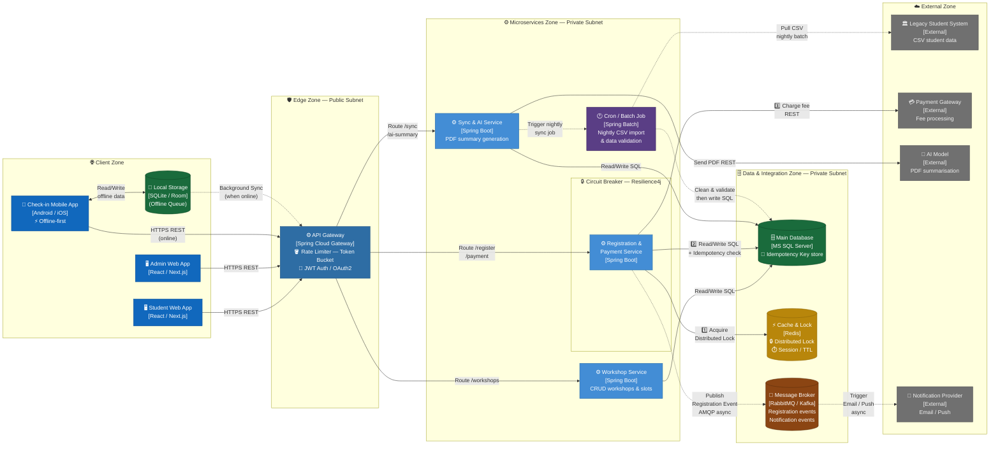

```mermaid
flowchart LR

%% ════════════════════════════════════════
%%  STYLES
%% ════════════════════════════════════════
classDef person     fill:#08427B,stroke:#08427B,color:#E8F2FF
classDef frontend   fill:#1168BD,stroke:#0D5099,color:#ffffff
classDef gateway    fill:#2E6DA4,stroke:#1A4F80,color:#ffffff
classDef service    fill:#438DD5,stroke:#2E6DA4,color:#ffffff
classDef datastore  fill:#1A6B3C,stroke:#0F4526,color:#ffffff
classDef broker     fill:#8B4513,stroke:#5C2E0A,color:#ffffff
classDef cache      fill:#B8860B,stroke:#8B6508,color:#ffffff
classDef external   fill:#707070,stroke:#505050,color:#F0F0F0
classDef batch      fill:#5A3E85,stroke:#3B2760,color:#ffffff

%% ════════════════════════════════════════
%%  CLIENT ZONE
%% ════════════════════════════════════════
subgraph CLIENT["🌐 Client Zone"]
    direction TB
    SWA["🖥️ Student Web App\n[React / Next.js]"]
    AWA["🖥️ Admin Web App\n[React / Next.js]"]
    CMA["📱 Check-in Mobile App\n[Android / iOS]\n⚡ Offline-first"]
    LDB[("💾 Local Storage\n[SQLite / Room]\n(Offline Queue)")]

    CMA <-->|"Read/Write\noffline data"| LDB
end

%% ════════════════════════════════════════
%%  EDGE / LOAD BALANCING ZONE
%% ════════════════════════════════════════
subgraph EDGE["🛡️ Edge Zone — Public Subnet"]
    direction TB
    GW["⚙️ API Gateway\n[Spring Cloud Gateway]\n🪣 Rate Limiter — Token Bucket\n👤 JWT Auth / OAuth2"]
end

%% ════════════════════════════════════════
%%  MICROSERVICES / APP ZONE
%% ════════════════════════════════════════
subgraph APP["⚙️ Microservices Zone — Private Subnet"]
    direction TB

    WS["⚙️ Workshop Service\n[Spring Boot]\nCRUD workshops & slots"]

    subgraph RPS_GROUP["🔒 Circuit Breaker — Resilience4j"]
        RPS["⚙️ Registration &\nPayment Service\n[Spring Boot]"]
    end

    SAS["⚙️ Sync & AI Service\n[Spring Boot]\nPDF summary generation"]

    BATCH["🕐 Cron / Batch Job\n[Spring Batch]\nNightly CSV import\n& data validation"]
end

%% ════════════════════════════════════════
%%  DATA & INTEGRATION ZONE
%% ════════════════════════════════════════
subgraph DATA["🗄️ Data & Integration Zone — Private Subnet"]
    direction TB
    DB[("🗄️ Main Database\n[MS SQL Server]\n🔑 Idempotency Key store")]
    REDIS[("⚡ Cache & Lock\n[Redis]\n🔒 Distributed Lock\n⏱️ Session / TTL")]
    MB[("📨 Message Broker\n[RabbitMQ / Kafka]\nRegistration events\nNotification events")]
end

%% ════════════════════════════════════════
%%  EXTERNAL ZONE
%% ════════════════════════════════════════
subgraph EXT["☁️ External Zone"]
    direction TB
    LSS["🏛️ Legacy Student System\n[External]\nCSV student data"]
    PGW["💳 Payment Gateway\n[External]\nFee processing"]
    AIM["🤖 AI Model\n[External]\nPDF summarisation"]
    NP["🔔 Notification Provider\n[External]\nEmail / Push"]
end

%% ════════════════════════════════════════
%%  DATA FLOWS — Synchronous (solid)
%% ════════════════════════════════════════

%% Clients → Gateway
SWA  -->|"HTTPS REST"| GW
AWA  -->|"HTTPS REST"| GW
CMA  -->|"HTTPS REST\n(online)"| GW
LDB  -.->|"Background Sync\n(when online)"| GW

%% Gateway → Services
GW   -->|"Route /workshops"| WS
GW   -->|"Route /register\n/payment"| RPS
GW   -->|"Route /sync\n/ai-summary"| SAS

%% Workshop Service → Data
WS   -->|"Read/Write SQL"| DB

%% Registration flow: Lock → DB
RPS  -->|"1️⃣ Acquire\nDistributed Lock"| REDIS
RPS  -->|"2️⃣ Read/Write SQL\n+ Idempotency check"| DB
RPS  -->|"3️⃣ Charge fee\nREST"| PGW

%% Sync & AI → Data
SAS  -->|"Read/Write SQL"| DB
SAS  -->|"Send PDF REST"| AIM

%% ════════════════════════════════════════
%%  DATA FLOWS — Asynchronous (dashed)
%% ════════════════════════════════════════

%% Registration events → Broker → Notification
RPS  -.->|"Publish\nRegistration Event\nAMQP async"| MB
MB   -.->|"Trigger\nEmail / Push\nasync"| NP

%% Nightly CSV batch
BATCH -.->|"Pull CSV\nnightly batch"| LSS
BATCH -.->|"Clean & validate\nthen write SQL"| DB

%% Sync & AI triggers batch
SAS  -.->|"Trigger nightly\nsync job"| BATCH

%% ════════════════════════════════════════
%%  CLASS ASSIGNMENTS
%% ════════════════════════════════════════
class SWA,AWA,CMA frontend
class LDB datastore
class GW gateway
class WS,RPS,SAS service
class BATCH batch
class DB datastore
class REDIS cache
class MB broker
class LSS,PGW,AIM,NP external
```
